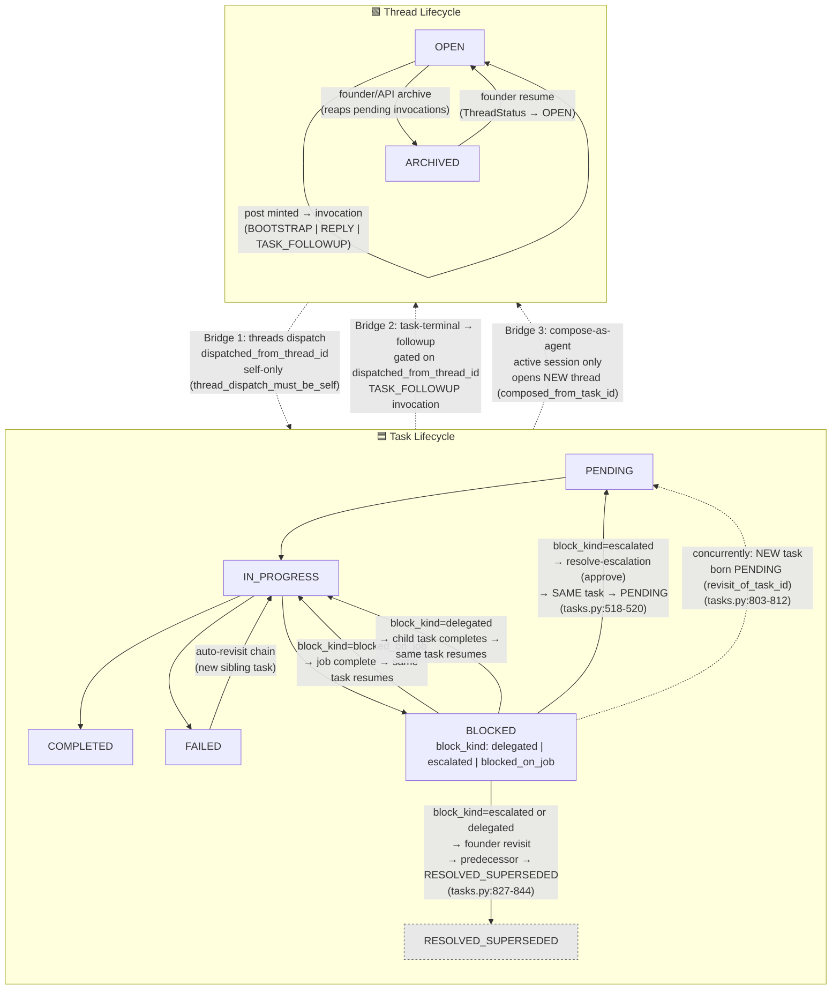

# Task ↔ Thread Lifecycle & Interaction Surfaces — Design Spec

**Date:** 2026-06-16
**Status:** Reference documentation (doc-only; no code changes).
**Origin:** Replaces the THR-027 thread one-pager. Provides a single durable artifact capturing the full lifecycle of both Task and Thread primitives, the three bridges that connect them, and the asymmetry rules that govern those bridges.
**Cross-references:**
- `2026-05-28-thread-task-followup-design.md` — the followup re-invocation spec, which this doc contextualizes within the broader lifecycle.
- `2026-05-13-threads-design.md` — the threads primitive design this extends.
- `runtime/models.py` — canonical enum definitions (`TaskStatus`, `BlockKind`, `ThreadStatus`, `ThreadInvocationPurpose`, `ThreadInvocationStatus`).
- `runtime/daemon/routes/threads.py` — bridge (1) `dispatch_from_thread_endpoint` and bridge (3) `compose_thread_as_agent`.
- `runtime/orchestrator/run_step.py` — bridge (2) `_maybe_post_thread_followup` / `_maybe_post_thread_escalation`.

---

## 1. Lifecycle Flowchart



**Mermaid validation:** Rendered as valid PNG via `mmdc -i test.mmd -o test.png` (2026-06-17). Output dimensions MUST be re-measured after this revision. See completion report.

---

## 2. Lifecycle Prose

### 2.1 Task Lifecycle

A task is the fundamental unit of work. It represents a single brief dispatched to a single agent. The task lifecycle is a finite state machine with six states (defined in `runtime/models.py` — `class TaskStatus(StrEnum)`):

| State | Meaning |
|---|---|
| **PENDING** | The task has been created but not yet claimed by the orchestrator for execution. |
| **IN_PROGRESS** | The orchestrator has claimed the task and is executing a session (or the task is in the run queue awaiting a slot). |
| **COMPLETED** | The task reached a successful terminal state. The agent reported `status=completed` via `report-completion`. |
| **FAILED** | The task reached an unsuccessful terminal state — either the agent reported a failure, the session timed out, or the task was cancelled. A FAILED task may trigger an auto-revisit chain (a new sibling task re-executing the same brief). |
| **BLOCKED** | The task cannot proceed. `block_kind` (defined in `class BlockKind(StrEnum)`) distinguishes three sub-types: `delegated` (waiting on a manager's next delegation decision), `escalated` (waiting on founder intervention), and `blocked_on_job` (waiting on an async job to complete). |
| **RESOLVED_SUPERSEDED** | A terminal state for blocked (`escalated` or `delegated`) tasks whose follow-up work was moved to a human-authorized continuation (founder `revisit` or a new thread-dispatched task). Distinct from COMPLETED so the audit trail shows the task was superseded rather than finished by an agent. This state joins every terminal predicate. |

**Transitions:**
- `PENDING → IN_PROGRESS`: Orchestrator claims the task for execution (`runtime/orchestrator/run_step.py:51, 114-124`).
- `IN_PROGRESS → COMPLETED`: Agent reports successful completion.
- `IN_PROGRESS → FAILED`: Agent reports failure, session times out, or task is cancelled.
- `IN_PROGRESS → BLOCKED`: Agent self-blocks via `report-completion` with `status=blocked`.
- `BLOCKED → IN_PROGRESS` (same task resumes directly): Two paths — (a) `blocked_on_job`: the job completes and the orchestrator unblocks the task directly to IN_PROGRESS (`run_step.py:114-124`); (b) `delegated`: the child task reaches a terminal state, the parent resumes directly to IN_PROGRESS.
- `BLOCKED → PENDING → IN_PROGRESS` (same task re-dispatched via PENDING): `block_kind=escalated` → founder issues `resolve-escalation` with decision `approve`, which sets the **same** task to `TaskStatus.PENDING` and enqueues it (`resolve_escalation_in_process` in `runtime/daemon/routes/tasks.py:518-520`). The orchestrator claim then transitions PENDING → IN_PROGRESS (`run_step.py:51, 114-124`). The PENDING step is NOT a direct jump to IN_PROGRESS — it is a full re-entry through the orchestrator claim path.
- `BLOCKED → RESOLVED_SUPERSEDED` (predecessor terminal; **NEW** task born): A human-authorized continuation that spawns a **NEW** root task, distinct from resuming the same task. Two triggers:
  - **Founder revisit:** `revisit_from_notification` (`tasks.py:803-812`) inserts a **NEW** root task with `status=TaskStatus.PENDING` and `revisit_of_task_id=predecessor.id`, then supersedes the eligible blocked predecessor to RESOLVED_SUPERSEDED via `_supersede_predecessor_locked` (`tasks.py:827-844`). The predecessor is terminal/superseded — it does NOT itself resume. The new task begins its own lifecycle from PENDING.
  - **Thread dispatch with `resolves`:** A manager dispatch carrying the `resolves` field also supersedes the predecessor via the same `_supersede_predecessor_locked` helper. Both leave the original blocked task terminal.
- `FAILED → IN_PROGRESS`: The orchestrator's auto-revisit logic spawns a new sibling task carrying the same brief (gated on revisit-chain length limits and task-type).

### 2.2 Thread Lifecycle

A thread is a persistent, multi-agent conversation channel. Its lifecycle has two states (defined in `runtime/models.py` — `class ThreadStatus(StrEnum)`):

| State | Meaning |
|---|---|
| **OPEN** | The thread is active. New posts can be made, invocations can be minted and consumed. |
| **ARCHIVED** | The thread is closed. No new posts or invocations. |

**Transitions:**
- `OPEN → OPEN`: A post is made to the thread. Each post addressed to a participant mints a new **invocation** for that participant — a single-use token with a `purpose` (defined in `class ThreadInvocationPurpose(StrEnum)`):
  - `BOOTSTRAP` — the initial invocation that starts a thread participant's first turn.
  - `REPLY` — an invocation to reply to an existing thread post.
  - `TASK_FOLLOWUP` — an invocation minted by the runtime (not by a human post) when a thread-dispatched task reaches a terminal state; the dispatching agent is re-invited to compose a follow-up reply.

  Each invocation has a `status` (defined in `class ThreadInvocationStatus(StrEnum)`):
  - `PENDING` — waiting to be consumed.
  - `CONSUMED` — the agent took the turn.
  - `DECLINED` — the agent declined the invocation.
  - `TIMEOUT` — the invocation expired without being consumed.
  - `FAILED` — the agent's session crashed or errored out.

- `OPEN → ARCHIVED`: An explicit founder or API action via `archive_thread_endpoint` (`runtime/daemon/routes/threads.py:1322`). It reaps any remaining pending REPLY/BOOTSTRAP invocations (declining them with reason "archive_started"), sets `ThreadStatus.ARCHIVED`, writes a final transcript, and appends a SYSTEM `archived` message. Archiving is NOT automatic on invocation exhaustion.
- `ARCHIVED → OPEN`: Reopening is supported. `resume_thread_endpoint` (`runtime/daemon/routes/threads.py:1390`) sets `ThreadStatus.OPEN` on an archived thread, appends a SYSTEM `resumed` message, and logs an audit entry. The thread is active again and new invocations can be minted.

---

## 3. The Three Bridges

The Task and Thread lifecycles intersect at exactly three interaction surfaces.

### Bridge 1: Thread Dispatch (Self-Only)

**Direction:** Thread → Task (a thread participant dispatches a new task).

**Endpoint:** `dispatch_from_thread_endpoint` in `runtime/daemon/routes/threads.py`.

**Governing rules (verified on origin/main):**

1. **Invocation purpose gate:** The caller must provide a valid invocation token with purpose `REPLY` or `BOOTSTRAP`. The validation call `_validate_invocation_token(…, require_purposes=[ThreadInvocationPurpose.REPLY, ThreadInvocationPurpose.BOOTSTRAP])` rejects any other purpose — including `TASK_FOLLOWUP`.

2. **Self-dispatch enforcement:** The target agent must equal the dispatcher. A non-self target is rejected with HTTP detail code `thread_dispatch_must_be_self`:
   ```
   if effective_target != dispatcher:
       raise HTTPException(
           status_code=403,
           detail={"code": "thread_dispatch_must_be_self", …},
       )
   ```
   This is the self-dispatch-only doctrine: from a thread, you may only dispatch work to yourself. Cross-agent dispatch must route through `compose` (a new thread) or direct task creation.

3. **Task linking:** On successful dispatch, the new `TaskRecord` is inserted with `dispatched_from_thread_id=thread_id`. This field is the sole linkage that bridges (2) and asymmetry rule (b) depend on.

4. **System message:** A `SYSTEM` message with `kind_tag: "task_dispatched"` is appended to the thread, recording the dispatch event.

5. **Supersede path (THR-018 §3a):** When the optional `resolves` field names a blocked predecessor, only a manager-authorized dispatch may auto-close it as `RESOLVED_SUPERSEDED`. Workers cannot supersede (`thread_supersede_not_authorized`).

### Bridge 2: Task-Terminal → Thread Followup

**Direction:** Task → Thread (a terminal task re-engages its originating thread).

**Functions:** `_maybe_post_thread_followup` and `_maybe_post_thread_escalation` in `runtime/orchestrator/run_step.py`.

**Governing rules (verified on origin/main):**

1. **Fire predicate — only for thread-dispatched tasks:** Both functions walk the task's revisit chain to find the original dispatch root and read `original.dispatched_from_thread_id`. When that field is `None`, the function is a silent no-op:
   ```
   thread_id = original.dispatched_from_thread_id
   if thread_id is None:
       # Not a thread-dispatched chain; silent no-op.
       return
   ```
   This means: only tasks born from Bridge (1) get a followup. Tasks created by the founder, by the orchestrator's auto-revisit, or by inline delegation chains do not.

2. **Terminal mapping to kind_tag:**
   - Status → system message `kind_tag`:
     - `COMPLETED` → `"task_completed"`
     - `RESOLVED_SUPERSEDED` → `"task_completed"` (same class; the row docstring states it "joins every terminal predicate")
     - `FAILED` (including cancelled) → `"task_failed"`
   - Escalation path: `_maybe_post_thread_escalation` emits `kind_tag: "task_escalated"`.

3. **TASK_FOLLOWUP invocation minting:** The shared helper `_append_followup_system_and_reinvoke` does three things atomically:
   (a) Appends a `SYSTEM` message to the thread.
   (b) Extends the thread's turn cap if needed (via `mint_followup_invocation_with_cap_extend`).
   (c) Mints a new invocation with `purpose=TASK_FOLLOWUP` for the dispatcher and enqueues it on the thread queue.

4. **What a TASK_FOLLOWUP turn CANNOT do:**
   - **Cannot dispatch:** The invocation purpose gate in `dispatch_from_thread_endpoint` explicitly only accepts `REPLY` and `BOOTSTRAP` — a `TASK_FOLLOWUP` purpose fails the `require_purposes` check (`wrong_invocation_purpose`).
   - **Cannot compose-as-agent:** The task is already terminal (`COMPLETED`, `FAILED`, or `RESOLVED_SUPERSEDED`), so `compose_thread_as_agent` rejects with `task_not_active` (status is not `pending`/`in_progress`). Even before that, the session is already dead, so `session_mismatch` would also fire.

   The TASK_FOLLOWUP turn is thus a **reply-only** turn — the dispatching agent can post a message to the thread but cannot create new tasks or new threads from it.

### Bridge 3: Compose-as-Agent

**Direction:** Task → Thread (an agent with an active task session opens a new thread).

**Endpoint:** `compose_thread_as_agent` in `runtime/daemon/routes/threads.py`.

**Governing rules (verified on origin/main):**

1. **Binding required:** The caller must supply both `task_id` and `session_id`. Absence raises HTTP detail `binding_required`:
   ```
   if not body.task_id or not body.session_id:
       raise HTTPException(status_code=422, detail={"code": "binding_required"})
   ```

2. **Task ownership:** The composer must be the task's `assigned_agent`. Mismatch raises `composer_not_task_owner`.

3. **Session match:** The supplied `session_id` must match the task's currently active session. Mismatch raises `session_mismatch`. The status gate runs before the session gate so a completed task surfaces `task_not_active` rather than a misleading `session_mismatch`.

4. **Recipient validation — NO team/role gate:** Recipients are validated only for existence (`unknown_agent` if the target is not an approved agent or lacks a workspace). There is no team-membership check, no role check, and no sender-recipient relationship check beyond the `empty_external_recipients` rule (at least one recipient must not be the composer, or `@founder` must appear).

5. **Thread creation:** On success:
   - A new `ThreadRecord` is created with `composed_from_task_id=body.task_id` and `composed_by=body.composer`.
   - The thread is opened in `OPEN` status.
   - Bootstrap invocations are minted for each non-composer recipient.
   - The new thread ID is returned to the caller.

---

## 4. Asymmetry Facts & Enum Tables

### 4.1 The Three Asymmetry Rules (from THR-027 seq=6)

**(a) The two entry directions are NOT symmetric.**

Bridge (1) — thread dispatch — enters from a thread and creates a task. Bridge (3) — compose-as-agent — enters from a task and creates a thread. They use different endpoints, different guards, different permission models, and serve different organizational purposes. There is no "reverse bridge (1)" — you cannot dispatch a thread *to* a task. The interaction is always directional.

**(b) Bridge (2) fires only for tasks BORN from bridge (1).**

The followup fire predicate explicitly gates on `original.dispatched_from_thread_id`. A task created by the founder, by the orchestrator's auto-revisit, or by inline delegation carries `dispatched_from_thread_id=None` and will never produce a thread followup. The `if thread_id is None: return` guard in both `_maybe_post_thread_followup` and `_maybe_post_thread_escalation` ensures this is a silent no-op with no audit trail.

**(c) Outbound reach is live-session-only, available ONLY via bridge (3).**

An agent can only open a new thread (`compose_thread_as_agent`) while it has an active task session. Once the task reaches a terminal state, the session dies and the `session_mismatch` + `task_not_active` gates block the bridge. A TASK_FOLLOWUP turn (bridge 2's result) is deliberately reply-only — it cannot dispatch (bridge 1 gate) and cannot compose (bridge 3 gate). The only way to start a new thread from a task is during the live task session via bridge (3).

### 4.2 Enum Value Tables

All sourced from `runtime/models.py`.

**TaskStatus** (`class TaskStatus(StrEnum)`):

| Value | Docstring summary |
|---|---|
| `pending` | Not yet claimed by the orchestrator |
| `in_progress` | Currently executing |
| `blocked` | Cannot proceed; see `block_kind` |
| `completed` | Successful terminal |
| `failed` | Unsuccessful terminal (agent failure, timeout, or cancel) |
| `resolved_superseded` | Terminal; blocked task superseded by human-authorized continuation |

**BlockKind** (`class BlockKind(StrEnum)`):

| Value | Meaning |
|---|---|
| `delegated` | Waiting on a manager delegation decision |
| `escalated` | Waiting on founder intervention |
| `blocked_on_job` | Waiting on an async job |

**ThreadStatus** (`class ThreadStatus(StrEnum)`):

| Value | Meaning |
|---|---|
| `open` | Active; posts and invocations allowed |
| `archived` | Closed; no new posts or invocations |

**ThreadInvocationPurpose** (`class ThreadInvocationPurpose(StrEnum)`):

| Value | Meaning |
|---|---|
| `reply` | Reply to an existing thread post |
| `bootstrap` | Initial invocation starting a participant's first turn |
| `task_followup` | Runtime-minted; re-invokes dispatcher after a dispatched task terminates |

**ThreadInvocationStatus** (`class ThreadInvocationStatus(StrEnum)`):

| Value | Meaning |
|---|---|
| `pending` | Waiting to be consumed |
| `consumed` | Agent took the turn |
| `declined` | Agent declined the invocation |
| `timeout` | Expired without consumption |
| `failed` | Agent session crashed/errored |
